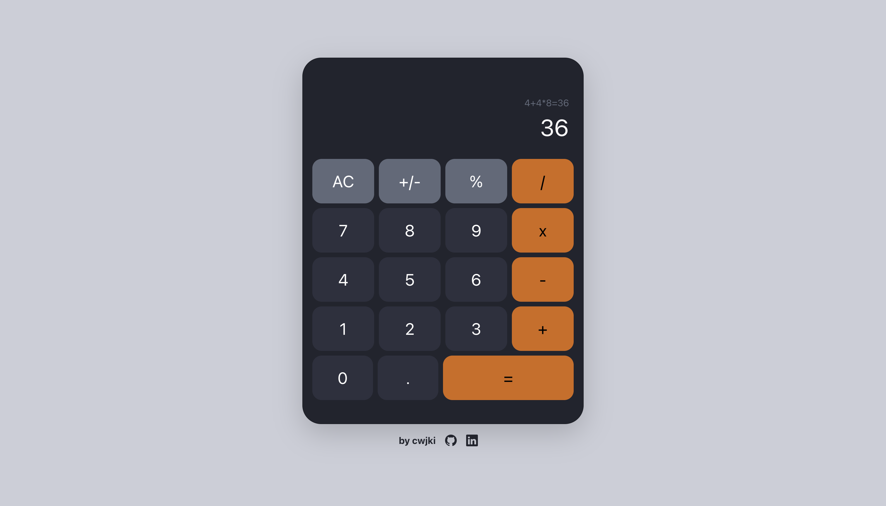

# Calculator

Fourth project to obtain the Front End Development Libraries certification from freeCodeCamp. Build a calculator with the following [specifications](https://www.freecodecamp.org/learn/front-end-development-libraries/front-end-development-libraries-projects/build-a-javascript-calculator).

####  

[Link to the Drum Machine](https://cwjki.github.io/calculator/) 